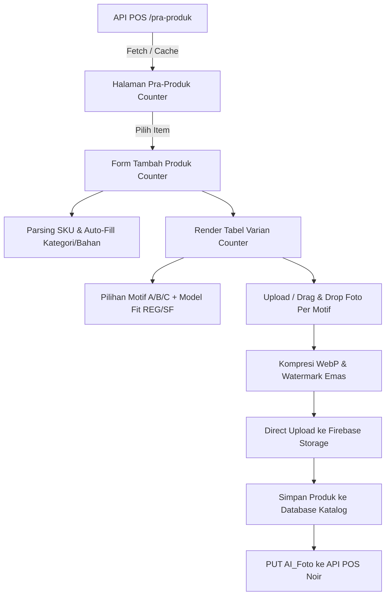

# 📖 Dokumentasi Fitur Pra-Produk Baru (Skema Counter & Multi-Motif)

Dokumen ini merupakan panduan arsitektur, alur data, dan perbandingan komprehensif antara **Fitur Pra-Produk Lama** dan **Fitur Pra-Produk Baru (Skema Counter)** pada Marketplace Batik Nusantara.

---

## 📑 Daftar Isi
1. [Gambaran Umum & Perubahan Paradigma](#1-gambaran-umum--perubahan-paradigma)
2. [Tabel Perbandingan: Pra-Produk Lama vs Pra-Produk Baru](#2-tabel-perbandingan-pra-produk-lama-vs-pra-produk-baru)
3. [Arsitektur & Spesifikasi Alur Data Baru](#3-arsitektur--spesifikasi-alur-data-baru)
4. [Standar Klasifikasi Barcode POS (API Noir v1/tipe) & Aturan Kategori](#4-standar-klasifikasi-barcode-pos-api-noir-v1tipe--aturan-kategori)
5. [Mesin Pemetaan Motif & Counter Otomatis](#5-mesin-pemetaan-motif--counter-otomatis)
6. [Sistem Pemrosesan & Penyimpanan Foto (Firebase Storage)](#6-sistem-pemrosesan--penyimpanan-foto-firebase-storage)
7. [Penanganan Model Fit (Regular Fit vs Slim Fit)](#7-penanganan-model-fit-regular-fit-vs-slim-fit)
8. [Aturan Khusus: Setelan, Kain, Gulungan & Kategori Lainnya](#8-aturan-khusus-setelan-kain-gulungan--kategori-lainnya)
9. [Tampilan & Alur Pembeli di Halaman Detail Produk](#9-tampilan--alur-pembeli-di-halaman-detail-produk)
10. [Arsitektur Berkas & Referensi Kode](#10-arsitektur-berkas--referensi-kode)

---

## 1. Gambaran Umum & Perubahan Paradigma

Pada sistem **Pra-Produk Lama**, satu barang POS dipetakan ke satu produk dengan varian ukuran statis (`All Size`, `S`, `M`, `L`, `XL`). Pendekatan ini memiliki keterbatasan saat satu kode barang di POS memiliki banyak counter fisik, outlet berbeda, atau motif batik yang berbeda antar-counter.

Pada sistem **Pra-Produk Baru (Skema Counter)**:
* Setiap baris **Counter/Outlet** dipertahankan secara modular dalam tabel varian interaktif.
* Mendukung **Multi-Motif (Motif A, B, C, dst.)** dengan foto & thumbnail spesifik per motif.
* Mengunggah langsung foto hasil watermark dan foto raw ke **Firebase Storage** dalam format **WebP**.
* Menyediakan kontrol batch cepat (set ukuran serentak, set model fit serentak, set harga serentak).
* Menyajikan alur belanja 2-langkah yang mewah bagi pembeli (**Pilih Motif $\rightarrow$ Pilih Ukuran $\rightarrow$ Model Fit**).

---

## 2. Tabel Perbandingan: Pra-Produk Lama vs Pra-Produk Baru

| Fitur / Parameter | Pra-Produk Lama (`tambah-produk.astro`) | Pra-Produk Baru (`tambah-produk-counter.astro`) |
| :--- | :--- | :--- |
| **Konsep Varian** | Checkbox ukuran statis (`S`, `M`, `L`, `XL`, `All Size`). | **Tabel Modular Per Counter/Outlet** dengan data stok, harga, dan SKU masing-masing. |
| **Dukungan Multi-Motif** | Terbatas pada pemisahan warna/kain dasar. | **Full Multi-Motif (`Motif A`, `Motif B`, dst.)** dengan foto & thumbnail per motif. |
| **Penyimpanan Foto** | Diunggah via Laravel CDN (nama file hash acak). | **Direct Firebase Storage**: File WebP terstruktur (`${code}_${motif}_${time}.webp`). |
| **Foto Raw (Master)** | Tidak tersimpan / hanya foto ter-watermark. | **Tersimpan Otomatis di Firebase** (`raw_images`) terpisah dari foto katalog (`images`). |
| **Watermark Engine** | Standar canvas client-side. | **Watermark Emas + Kode SKU** presisi tinggi dengan fallback visual badge & nama motif. |
| **Fitur Unggah Foto** | Input file biasa. | **Drag & Drop**, **Copy-Paste (Clipboard)**, dan klik langsung pada thumbnail. |
| **Pilihan Model Fit** | Berdasarkan checkbox deteksi nama string. | **Dropdown MODEL FIT per baris (`Regular Fit` vs `Slim Fit`)** + alat **Batch Fit Serentak**. |
| **Pengaturan Serentak** | Pengisian per field terpisah. | **Toolbar Batch Cepat**: *Set Motif*, *Set Ukuran*, *Set Model Fit*, *Set Harga*, *Set Furing*. |
| **Loading Feedback** | Tanpa indikator visual saat proses berat. | **Modal Loading Overlay** dengan backdrop blur & animasi spinner saat kompresi & upload. |
| **Alur UI Pembeli** | Memilih ukuran umum langsung. | **Alur Bertingkat Mewah**: Pembeli memilih **Motif** $\rightarrow$ **Ukuran** $\rightarrow$ **Model Fit**, foto berganti otomatis. |
| **Format Pesan WA** | Format varian standar. | **Format Pesan Lengkap**: Menyertakan motif, ukuran, fit, dan furing secara presisi. |

---

## 3. Arsitektur & Spesifikasi Alur Data Baru



### Pemetaan Data API POS ke Form Counter:
* `item.kodeitem`: Dasar pembuatan nama produk & kode prefix motif.
* `item.kode`: SKU POS yang di-parse menggunakan rumus 7 posisi (`$tipe1` s/d `$supplier`).
* `details[]`: Setiap elemen array menjadi 1 baris dalam tabel counter dan disimpan ke payload varian database:
  * `d.counter` $\rightarrow$ `variant.counter` & `variant.sku` (Nomor Counter unik POS).
  * `d.outlet` $\rightarrow$ `variant.outlet` (Nama outlet / lokasi fisik counter).
  * `d.size` $\rightarrow$ `variant.size_name` (Murni nama ukuran dasar: `S`, `M`, `L`, `XL`, `ALL SIZE`).
  * `sleeve` (deteksi LP/PD) $\rightarrow$ `variant.sleeve` (`Panjang` / `Pendek` / `3/4` / `-`).
  * `d.size` / `d.kode` (deteksi `SF`) $\rightarrow$ `variant.fit` (`REG` = Regular Fit / `SF` = Slim Fit).
  * `d.hjual` $\rightarrow$ `variant.price` (Harga jual per counter).
  * `d.stok` $\rightarrow$ `variant.stock` (Stok fisik per counter).
  * `d.dalaman` $\rightarrow$ `variant.dalaman` (`F` = Furing / `TF` = Non Furing).
  * `motif` $\rightarrow$ `variant.motif` & `variant.image_url` (Foto spesifik motif counter).

---

## 4. Standar Klasifikasi Barcode POS (API Noir v1/tipe) & Aturan Kategori

Seluruh proses klasifikasi kategori, bahan, proses batik, warna, dan ukuran mengacu **100% pada struktur kode barcode POS 17 digit** dari API resmi Noir (`https://noir.grace.gracianna.web.id/api/v1/tipe`). Kode barcode diprioritaskan mutlak dibandingkan teks nama produk.

### A. Anatomi Barcode 17 Digit POS

```text
Contoh Kode:  W  I  0  S  P  0  J  E  D  9  9  0  2  0  3  1  1
Posisi Digit: 1  2  3  4  5  6  7  8  9  10 11 12 13 14 15 16 17
              │  │  │  │  │  │  └───────────────────────────────┘
              │  │  │  │  │  └─ Digit 6 : t4 (Warna Utama)
              │  │  │  │  └──── Digit 5 : t6 (Proses / Detail)
              │  │  │  └─────── Digit 4 : t3 (Bahan Kain)
              │  │  └────────── Digit 3 : t5 (Ukuran Dasar)
              │  └───────────── Digit 2 : t2 (Kategori Utama / Sub-Aksesoris)
              └──────────────── Digit 1 : t1 (Divisi / Gender)
```

---

### B. Aturan Klasifikasi Karakter ke-2 (`t2`): Non-Aksesoris vs Aksesoris

1. **Aturan Non-Aksesoris (Level 1 Mandiri):**
   * Semua kategori pakaian/busana non-aksesoris langsung ditetapkan sebagai **Level 1** di database marketplace.
2. **Aturan Aksesoris (Level 2 di bawah "Accessories"):**
   * Semua item aksesoris (*Syal, Selendang, Kalung/Anting, Bros, Topi, Sabuk*) dimasukkan sebagai **Level 2**, dengan **Level 1 = "Accessories"**.
3. **Aturan Otomatis Buat Kategori Baru (Auto-Create):**
   * Jika kategori Level 1 atau sub-aksesoris Level 2 belum terdaftar di database marketplace, sistem secara otomatis:
     * Menambahkan opsi baru ke dropdown form client-side secara real-time.
     * Membuat data kategori baru di database backend (`POST /types`) saat form produk disimpan.

#### 📋 Tabel Pemetaan Karakter ke-2 (`t2`):

| Kode `t2` | Keterangan API Noir | Tingkat Kategori | Target Kategori Marketplace |
| :---: | :--- | :---: | :--- |
| **`K`** | KEMEJA | **Level 1** | **Kemeja** |
| **`B`** | BLUES | **Level 1** | **Blues** |
| **`P`** | DRESS | **Level 1** | **Dress** |
| **`G`** | GAUN | **Level 1** | **Gaun** |
| **`X`** | GAMIS | **Level 1** | **Gamis** |
| **`R`** | ROK | **Level 1** | **Rok** |
| **`C`** | CELANA | **Level 1** | **Celana** |
| **`E`** | LEGGING | **Level 1** | **Legging** |
| **`F`** | SARUNG | **Level 1** | **Sarung** |
| **`O`** | OUTER | **Level 1** | **Outer** |
| **`J`** | JAKET | **Level 1** | **Jaket** |
| **`A`** | JAS | **Level 1** | **Jas** |
| **`V`** | KEBAYA | **Level 1** | **Kebaya** |
| **`S`** | STELAN | **Level 1** | **Setelan** |
| **`U`** | JUMPSUIT | **Level 1** | **Jumpsuit** |
| **`T`** | T - SHIRT | **Level 1** | **T - Shirt** |
| **`N`** | TANK TOP | **Level 1** | **Tank Top** |
| **`M`** | SARIMBIT | **Level 1** | **Sarimbit** |
| **`L`** | SYAL | **Level 2** | Level 1: **Accessories** • Level 2: **Syal** |
| **`H`** | SELENDANG | **Level 2** | Level 1: **Accessories** • Level 2: **Selendang** |
| **`Q`** | KLG/ANTG | **Level 2** | Level 1: **Accessories** • Level 2: **Kalung / Anting** |
| **`W`** | BROS | **Level 2** | Level 1: **Accessories** • Level 2: **Bros** |
| **`I`** | TOPI | **Level 2** | Level 1: **Accessories** • Level 2: **Topi** |
| **`D`** | SABUK | **Level 2** | Level 1: **Accessories** • Level 2: **Sabuk** |

---

### C. Tabel Lengkap Segmen Barcode Lainnya (Sesuai API Noir)

#### 1. Karakter 1 (`t1` - Divisi / Gender):
`L`=LADYS, `M`=MAN, `A`=ASESORIS, `T`=TAS, `J`=JAM, `K`=KOSMETIK, `S`=SEPATU, `D`=SANDAL, `E`=DOMPET, `W`=WANITA, `Y`=YUAN-YUAN, `X`=KONSI, `I`=KAIN, `R`=SARIMBIT, `G`=GULUNGAN, `C`=METERAN, `P`=KPJ.

#### 2. Karakter 3 (`t5` - Ukuran Dasar):
* **`S`** = S, **`M`** = M, **`L`** = L, **`X`** = XL, **`Y`** = XXL
* **`2`** = 2L, **`3`** = 3L, **`4`** = 4L, **`5`** = 5L, **`6`** = 6L, **`7`** = 7L
* **`0`** = ALL SIZE

#### 3. Karakter 4 (`t3` - Bahan Kain / Level 2 untuk Pakaian):
* **`T`** = KATUN (Target L2: Katun)
* **`G`** = SUTRA (Target L2: Sutra)
* **`M`** = TENUN (Target L2: Tenun)
* **`S`** = SATEN (Target L2: Saten)
* **`D`** = DOBY (Target L2: Dobby)
* **`A`** = BROKLAT (Target L2: Broklat)
* **`F`** = SIFONE (Target L2: Sifone)
* **`E` / `H`** = PARIS (Target L2: Paris)
* **`V`** = VISCOS (Target L2: Viscos)
* **`J`** = JEANS (Target L2: Jeans)
* **`K`** = KAOS (Target L2: Kaos)
* **`P`** = PARASIT, **`N`** = NILON, **`B`** = BENANG, **`L`** = KALDORE, **`U`** = KULIT, **`R`** = BLUDRU, **`C`** = JERUK, **`I`** = BABY, **`W`** = SILKY, **`X`** = KREP.

#### 4. Karakter 5 (`t6` - Proses / Detail Level 3):
* **`P`** = **PRINT** (Target L3: Printing)
* **`C`** = **CAP** (Target L3: Cap)
* **`T`** = **TULIS** (Target L3: Tulis)
* **`R`** = **PERADA** (Target L3: Prada)
* **`S`** = **TULISP** *(Tulis Print)* (Target L3: Tulis)
* **`Q`** = **PERADAP** *(Perada Print)* (Target L3: Prada)

#### 5. Karakter 6 (`t4` - Warna Utama):
* **`H`** = HITAM, **`P`** = PUTIH, **`M`** = MERAH, **`K`** = KUNING, **`I`** = HIJAU
* **`B`** = BIRU, **`A`** = ABU-ABU, **`C`** = COKLAT, **`N`** = PINK, **`O`** = ORANGE
* **`J`** = JINGGA, **`U`** = UNGU, **`R`** = KREM, **`S`** = SILVER, **`W`** = WARNAWARNI

#### 6. Suffix / Substring Barcode (Dalaman / Furing):
* Memuat **`TF`** ➔ **Tanpa Furing (TF)**
* Memuat **`F`** (tanpa T) ➔ **Furing (F)**

---

### D. Banner Referensi POS & Verifikasi Keakuratan Data

Pada halaman input produk counter, sistem menyediakan **Master POS Reference Badge Card** (Navy Card) yang menampilkan informasi asli mentah dari POS:
1. 📌 **Kode Barcode POS Lengkap** (Monospace Yellow, misal `WI0SP0JED99020311`, `MKYTPRSUL01831482`)
2. 🏷️ **Kode Barang Model** (Monospace Sky Blue, misal `D021`, `I327`)
3. 📦 **Nama Mentah POS** (misal `KMJ 18701 MUST TF`, `KMJ 5166 MARON TF`)
4. ✨ **Uraian Tipe Terdeteksi** (Hasil parsing lengkap 6 digit: *MAN • KEMEJA • Bahan: KATUN • Proses: PRINT • Warna: COKLAT • Ukuran: M*)
5. 🆔 **ID Master POS**

## 5. Mesin Pemetaan Motif & Counter Otomatis

Setiap counter secara otomatis diberikan abjad motif berdasarkan indeks urutan:
* Baris 1 $\rightarrow$ `Motif A`
* Baris 2 $\rightarrow$ `Motif B`
* Baris 3 $\rightarrow$ `Motif C`
* ...dan seterusnya.

### Sinkronisasi Foto Per Motif:
Jika seller mengunggah foto baru untuk `Motif A`:
1. Sistem otomatis memperbarui thumbnail seluruh baris counter yang memiliki motif `Motif A`.
2. Kartu ringkasan foto motif di bagian bawah tabel otomatis terupdate.
3. Seller tidak perlu mengunggah foto berulang kali untuk counter yang memiliki motif yang sama.

---

## 6. Sistem Pemrosesan & Penyimpanan Foto (Firebase Storage)

### A. Format Struktur Folder & Penamaan Berkas
Berkas disimpan langsung ke Google Firebase Storage bucket `katalog-batik` dengan struktur hierarki folder rapi:
```text
📂 [jenis_produk]/
   └── 📂 [kode_item]/
       └── 📂 [motif]/
           ├── 📂 raw/
           │   └── [kode_item]_[motif]_raw_[timestamp]_[idx].webp
           └── 📂 katalog/
               └── [kode_item]_[motif]_[timestamp]_[idx].webp
```

* **Foto Katalog (Dengan Watermark Logo Emas & Kode)**:  
  `${jenis_produk}/${kode_item}/${motif}/katalog/${actualCode}_${cleanMotifTag}_${timestamp}_${motifIdx}.webp`  
  *(Contoh: `kemeja/NK157Q/motif-a/katalog/NK157Q_motif-a_1787302492_1.webp`)*
* **Foto Raw (Arsip Master Bersih Tanpa Watermark)**:  
  `${jenis_produk}/${kode_item}/${motif}/raw/${actualCode}_${cleanMotifTag}_raw_${timestamp}_${motifIdx}.webp`  
  *(Contoh: `kemeja/NK157Q/motif-a/raw/NK157Q_motif-a_raw_1787302492_1.webp`)*

### B. Spesifikasi Kompresi WebP (Sharp)
* **Katalog**: Format WebP, Quality `80`, dilengkapi Logo Emas Java Batik & Kode SKU.
* **Raw**: Format WebP, Quality `85`, bersih tanpa teks & logo (arsip jernih).

### C. Sinkronisasi Balik ke POS Noir
Setelah produk tersimpan di marketplace, sistem mengirimkan request:
```http
PUT /api/v1/beli1/{id}/ai-foto
Content-Type: application/json

{
  "AI_foto": "https://storage.googleapis.com/.../motif-a/katalog/NK157Q_motif-a_xxx.webp"
}
```

---

## 7. Penanganan Model Fit (Regular Fit vs Slim Fit)

Pada Pra-Produk Baru, penanganan model fit diatur secara eksplisit:
1. **Deteksi Otomatis POS**:
   * Jika ukuran mengandung `"SF"` (misal `XL SF` atau kode barang SF), dropdown baris otomatis terset ke **`Slim Fit (SF)`**.
   * Jika tidak ada `"SF"`, otomatis terset ke **`Regular Fit`**.
2. **Pengaturan Manual & Batch**:
   * Seller dapat mengganti fit pada masing-masing baris counter melalui dropdown **`MODEL FIT`**.
   * Atau menggunakan tombol **`✂️ Model Fit: [ Regular Fit / Slim Fit ]` $\rightarrow$ `Set Fit`** pada toolbar batch.
3. **Format Sinkronisasi Varian**:
   * Saat disimpan, nama varian (`size_name`) secara otomatis menambahkan akhiran ` SF` jika Slim Fit dipilih (misal `XL SF` atau `Motif A - XL SF`).

---

## 8. Aturan Khusus: Setelan, Kain, Gulungan & Kategori Lainnya

### A. Produk Setelan (STELAN / 1 Set Lengkap)
* **Identifikasi**: Kode SKU posisi ke-2 bernilai **`S`** (contoh: `WS...`) atau nama kategori memuat kata `STELAN` / `SETELAN`.
* **Karakteristik POS**: Di sistem POS gudang, setelan sering dicatat per potong (Atasan sendiri, Bawahan sendiri) dengan harga terpisah (misal @ Rp 495.000).
* **Perlakuan di Marketplace**:
  * **Harga Otomatis Terakumulasi**: Sistem secara otomatis menjumlahkan harga Atasan + Bawahan ($\text{Rp } 495.000 + \text{Rp } 495.000 = \text{Rp } 990.000$).
  * **Stok Setelan Terpadu**: Dihitung dari batas minimum pasangan lengkap yang tersedia ($\min(\text{stok atasan}, \text{stok bawahan})$).
  * **Di Halaman Detail Produk**: Menampilkan opsi ukuran sebagai **1 Set Lengkap** (`[ S (1 Set) ]`, `[ M (1 Set) ]`, `[ L (1 Set) ]`) tanpa memecah atasan/bawahan, karena setelan dipasarkan sebagai satu kesatuan busana lengkap.

---

### B. Produk Kain Potongan (Kain Batik Lembaran)
* **Identifikasi**: Kode SKU posisi ke-1 bernilai **`I`** (KAIN) atau kategori `KAIN`.
* **Perlakuan di Marketplace**:
  * **Ukuran Default**: Otomatis disetel ke `ALL SIZE` (atau panjang kain misal `2.00 Meter`).
  * **Model Fit**: Dinonaktifkan (karena kain lembaran belum dijahit menjadi pakaian).
  * **Furing**: Otomatis bernilai `Tanpa Furing`.
  * **Multi-Motif**: Jika dalam 1 kode barang terdapat beberapa lembar kain dengan motif corak berbeda di tiap counter, masing-masing counter langsung dipetakan sebagai **Motif A**, **Motif B**, dst. lengkap dengan foto kain aslinya.

---

### C. Kain Gulungan / Meteran Roll
* **Identifikasi**: Kode SKU posisi ke-1 bernilai **`G`** (GULUNGAN) atau **`C`** (METERAN).
* **Perlakuan di Marketplace**:
  * **Kuantitas Stok**: Jika diawali huruf `'G'`, stok otomatis di-set ke **`55 Meter`** (standar 1 roll gulungan kain batik).
  * **Deteksi Meteran**: Jika nama barang memuat angka meteran (misal `2.00 78122`), sistem mendeteksi kain panjang 2 Meter dan membagi harga jual sesuai divider meteran.

---

### D. Pembedaan Kategori Atasan vs Non-Atasan (Sleeve & Fit Logic)
* **Kategori Atasan** (`KEMEJA`, `HEM`, `BLOUSE`, `TUNIK`, `KOKO`, `PDH`, `JAKET`, `ATASAN`):
  * Mengaktifkan kontrol **Pilihan Lengan** (Pendek vs Panjang).
  * Mengaktifkan opsi **Model Fit** (`Regular Fit` vs `Slim Fit`).
* **Kategori Non-Atasan** (`DRESS`, `GAUN`, `GAMIS`, `ROK`, `CELANA`, `KAIN`, `SARUNG`, `JAS`, `SYAL`):
  * Sakelar lengan dan opsi Slim Fit spesifik kemeja otomatis dinonaktifkan/dikunci agar data katalog tetap presisi.

---

### E. Produk Sarimbit (Couple Pasangan)
* **Identifikasi**: Kode SKU posisi ke-1 bernilai **`R`** (SARIMBIT) atau posisi ke-2 bernilai **`M`**.
* **Perlakuan di Marketplace**:
  * Menyatukan busana Pria & Wanita dalam 1 display produk dengan opsi pasangan ukuran (contoh: Kemeja Pria L + Dress Wanita M).

---

## 9. Tampilan & Alur Pembeli di Halaman Detail Produk

Pada halaman detail produk pembeli ([`/products/[id].astro`](file:///Users/ajisampurno/Project/Batik/java-batik-marketplace/src/pages/products/[id].astro)):

```
┌────────────────────────────────────────────────────────┐
│  Kemeja Sutra Tulis Bunga Abu-abu NK157Q               │
│  Rp 3.750.000                                          │
│                                                        │
│  [ Panel Spesifikasi: Kategori › Motif › Warna Utama ] │
│                                                        │
│  PILIHAN MOTIF & UKURAN                                │
│  1. Pilih Motif:                                       │
│     [ 📷 Motif A ]  [ 📷 Motif B ]                      │
│                                                        │
│  2. Pilih Ukuran:                                      │
│     [ S ]  [ M ]  [ L ]  [ XL ]                        │
│                                                        │
│  3. Model & Harga (Jika ada opsi Fit):                 │
│     [ Regular Fit - Ready ]  [ Slim Fit - Sisa 1 ]     │
│                                                        │
│  [ Chat Admin WhatsApp ]                               │
└────────────────────────────────────────────────────────┘
```

1. **Langkah 1 (Pilih Motif)**: Mengklik motif langsung mengganti foto utama katalog ke motif tersebut.
2. **Langkah 2 (Pilih Ukuran)**: Hanya menampilkan ukuran yang tersedia untuk motif yang sedang aktif.
3. **Langkah 3 (Pilih Model Fit)**: Jika motif & ukuran tersebut memiliki pilihan Regular Fit dan Slim Fit, pembeli dapat memilih model yang diinginkan.
4. **Pesan WhatsApp Real-Time**:
   > *"Halo, saya tertarik dengan produk Kemeja Sutra Tulis Bunga Abu-abu (NK157Q) variasi Motif A - XL (Slim Fit - Dengan Furing). Apakah masih tersedia?"*

---

## 10. Arsitektur Berkas & Referensi Kode

1. **Halaman Pra-Produk Baru (Tabel Counter & Batch Engine)**:
   - [`src/pages/buka-toko/tambah-produk-counter.astro`](file:///Users/ajisampurno/Project/Batik/java-batik-marketplace/src/pages/buka-toko/tambah-produk-counter.astro)
   - [`src/pages/buka-toko/pra-produk-counter.astro`](file:///Users/ajisampurno/Project/Batik/java-batik-marketplace/src/pages/buka-toko/pra-produk-counter.astro)

2. **Halaman Pra-Produk Lama (Skema Checkbox Statis)**:
   - [`src/pages/buka-toko/tambah-produk.astro`](file:///Users/ajisampurno/Project/Batik/java-batik-marketplace/src/pages/buka-toko/tambah-produk.astro)
   - [`src/pages/buka-toko/pra-produk.astro`](file:///Users/ajisampurno/Project/Batik/java-batik-marketplace/src/pages/buka-toko/pra-produk.astro)

3. **Halaman Katalog & Detail Varian Pembeli**:
   - [`src/pages/products/[id].astro`](file:///Users/ajisampurno/Project/Batik/java-batik-marketplace/src/pages/products/[id].astro)
   - [`src/components/ProductCard.astro`](file:///Users/ajisampurno/Project/Batik/java-batik-marketplace/src/components/ProductCard.astro)

4. **Layanan Firebase Storage Direct Upload**:
   - [`src/lib/firebase.ts`](file:///Users/ajisampurno/Project/Batik/java-batik-marketplace/src/lib/firebase.ts)
